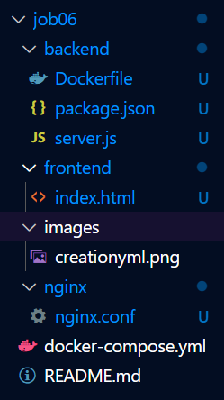
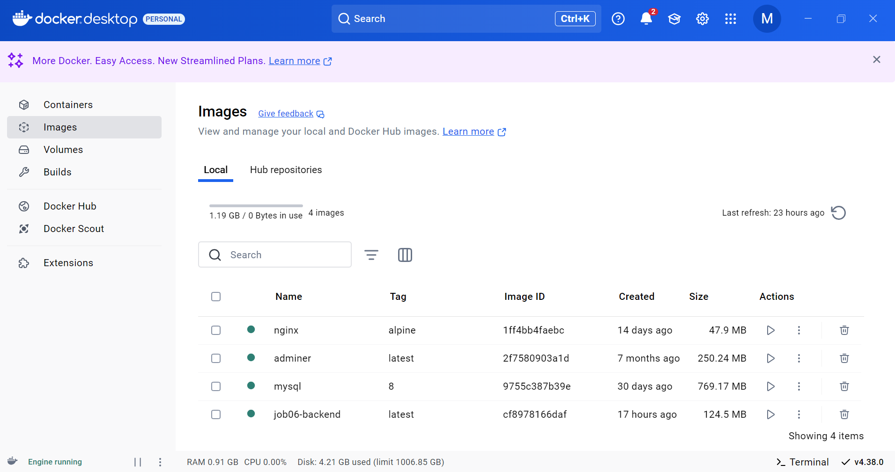
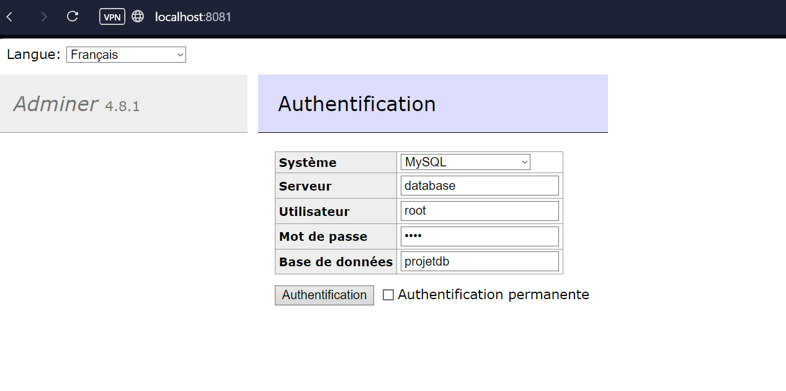

# JOB 06 

## création du fichier docker-compose.yml

Voici la creation du fichier docker-compose.yml 

---

## dossier backend + frontend

Voici la creation des dossiers backend, frontend,nginx 

---

## capture des images du job06

Voici la capture d'écran des images du job06  

---

## localhost:8081

Voici la page du port 8081  

---
