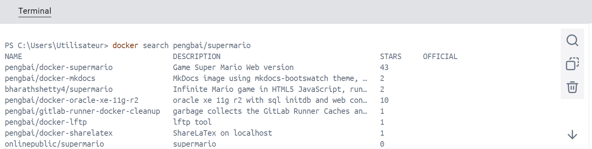
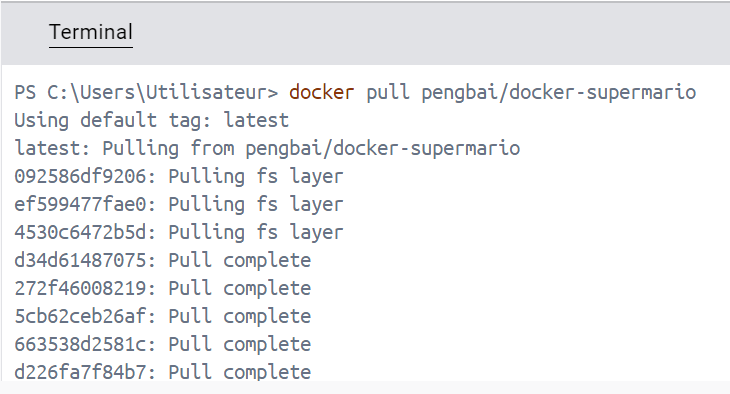
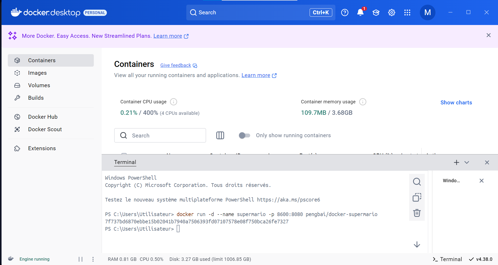
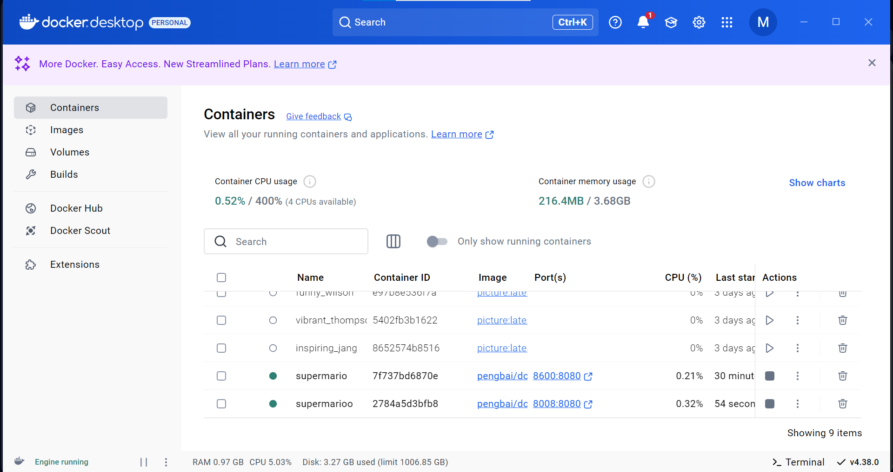
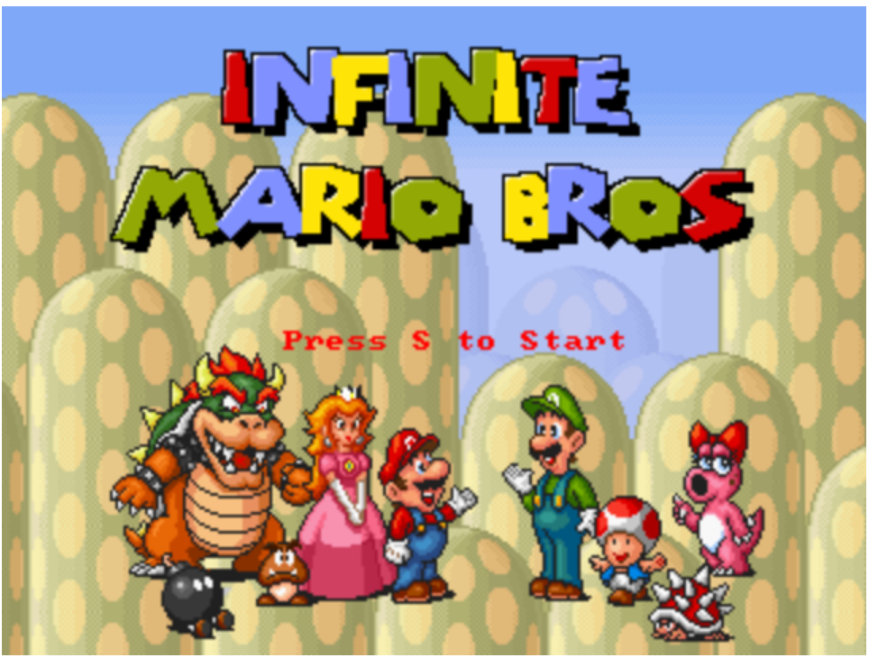
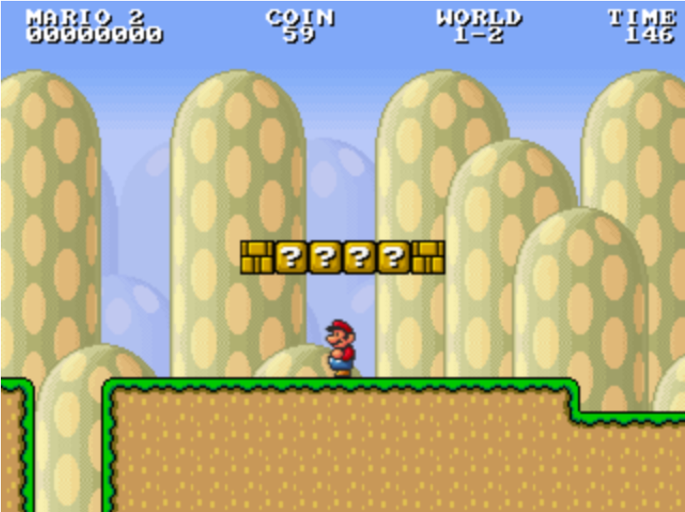
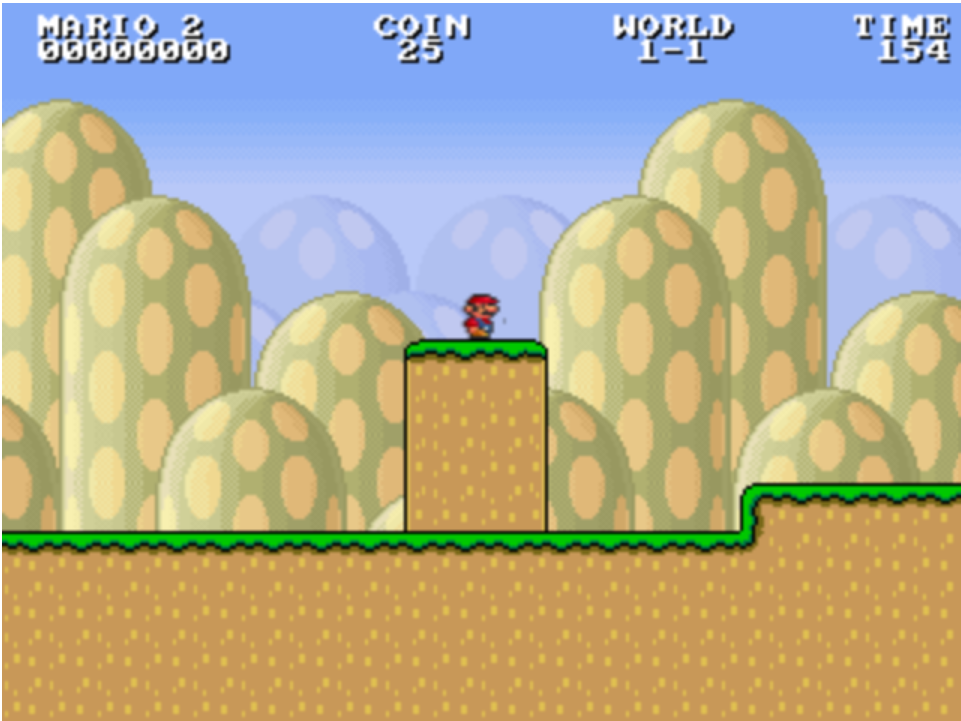

# DOCKER JOB 03

## docker recherche img

recherche de l'image supermario

---
## docker recuperer img

récupération de l'image supermario

---

## docker lancer container

lancement du container port 8600

---

## docker 2eme lancement

Essai 2

---
## commencer le jeu 

démarrer lejeu  

---

## jeu 

---

